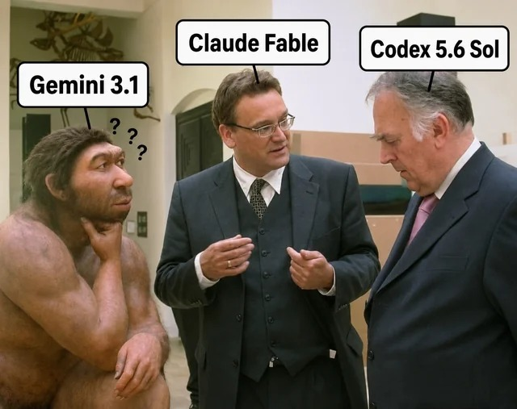

# Speech Separation Architectures & Benchmarks

Welcome to the `speech-sep` repository! This project explores, benchmarks, and introduces novel architectures for the highly challenging problem of multi-speaker speech separation, with a particular focus on 5-speaker scenarios (Libri5Mix).

As the number of concurrent speakers increases beyond 2 or 3, traditional separation methods face combinatorial explosion in training (due to Permutation Invariant Training) and degraded acoustic quality (regression-to-the-mean). This repository tackles these issues through three main avenues:

## 📁 Repository Structure

### 1. [Benchmarking Existing Models](./Benchmarking%20Existing%20Models/)
A collection of Jupyter notebooks evaluating the current state-of-the-art in speech separation.
- **SepFormer & ConvTasNet**: Evaluated on 3-speaker separation (Libri3Mix). SepFormer shows strong performance (~18.6 dB SI-SNRi).
- **MossFormer2 & SVoice**: Evaluated on the much harder 5-speaker task (Libri5Mix). Performance drops significantly, highlighting the need for novel architectures (MossFormer2 achieves ~4.3 dB SI-SNRi).

### 2. [GenCorrSep (Generative Corrector + ESSD)](./GenCorrSep/)
A novel two-stage architecture designed to solve the memory explosion of 5-speaker separation and the muffled audio problem.
- **Stage 1 (ESSD)**: An Early Split Shared Decoder that uses a shared Siamese architecture to process all 5 speakers in parallel, massively reducing VRAM usage.
- **Stage 2 (Generative Corrector)**: A Fast-GeCo Flow Matching U-Net that refines the coarse, safe estimations from Stage 1 into crisp, high-frequency audio using an Euler ODE solver.

### 3. [Deflationary Mamba Extractor (DME)](./dme/)
A novel iterative extraction model utilizing Mamba State Space Models (SSMs). 
- **O(L) Complexity**: Replaces expensive O(L²) attention mechanisms with highly efficient bidirectional Mamba blocks for long-form audio.
- **No PIT Required**: Uses a deflationary approach, extracting one speaker at a time and subtracting it from the residual, bringing complexity down from O(N!) to O(K×N).
- **Confidence-Based Stopping**: A learned confidence head naturally determines how many speakers are present in the mixture and stops extraction when finished.

---

## 🚀 Getting Started

The models in this repository are designed to be trained in heavy-compute environments (e.g., Kaggle RTX 6000 Pro or A100 instances). 

Each subdirectory contains its own detailed `README.md` and Jupyter Notebook(s) ready to be uploaded and run on Kaggle. For dataset requirements, most models expect the **Libri5Mix** or **Libri3Mix** datasets.

Check out the individual folders for deep dives into their respective architectures and training methodologies!

